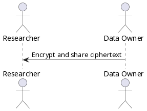
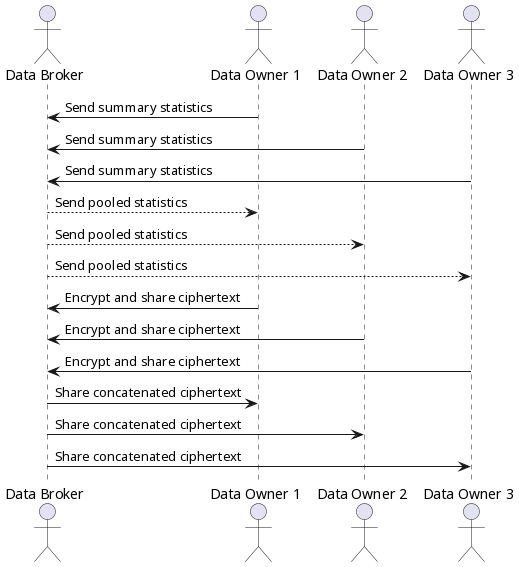

[](https://ci.systemreboot.net/jobs/pyhegp)

pyhegp is a Python library and CLI utility implementing homomorphic encryption of genotypes and phenotypes as described in
- [Private Genomes and Public SNPs: Homomorphic Encryption of Genotypes and Phenotypes for Shared Quantitative Genetics](https://academic.oup.com/genetics/article/215/2/359/5930450)
- [Using encrypted genotypes and phenotypes for collaborative genomic analyses to maintain data confidentiality](https://academic.oup.com/genetics/article/226/3/iyad210/7470728)

# Table of contents
- [Install development version](#install-development-version)
  - [Using pip](#using-pip)
  - [Using Guix](#using-guix)
- [How to use](#how-to-use)
  - [Simple data sharing](#simple-data-sharing)
  - [Joint/federated analysis with many data owners](#jointfederated-analysis-with-many-data-owners)
- [File formats](#file-formats)
- [Run tests](#run-tests)
- [License](#license)

# Install development version
## Using pip
### Create a virtual environment (optional)
In a new directory, create a python virtual environment and activate it.
```
mkdir pyhegp
cd pyhegp
python3 -m venv .venv
source .venv/bin/activate
```
### Install pyhegp
Install the development version of pyhegp. If you are in a virtual environment, pyhegp will be installed in it. If you skipped the previous step, pyhegp will be installed in your user install directory (that's typically in your home directory).
```
pip install git+https://github.com/encryption4genetics/pyhegp
```

## Using Guix

Put the following into a `channels.scm` file.
```scheme
(use-modules (guix ci))

(list (channel
        (name 'pyhegp)
        (url "https://github.com/encryption4genetics/pyhegp")
        (branch "main"))
      (channel-with-substitutes-available %default-guix-channel
                                          "https://ci.guix.gnu.org"))
```
Build a Guix profile using this `channels.scm` and activate it.
```
guix pull -C channels.scm -p pyhegp-profile
source ./pyhegp-profile/etc/profile
```
Drop into a shell where pyhegp is installed.
```
guix shell pyhegp
```
Now, you can use pyhegp.
```
pyhegp --help
```

# How to use
## Simple data sharing



In this simple scenario, there is only one data owner and they wish to share their encrypted data with a researcher. The data owner encrypts their genotype and phenotype data with:
```
pyhegp encrypt genotype.tsv phenotype.tsv
```
They then send the encrypted `genotype.tsv.hegp` and `phenotype.tsv.hegp` to the researcher. Note that data sharing is carried out-of-band and is outside the scope of `pyhegp`.

## Joint/federated analysis with many data owners



Data owners generate summary statistics for their data.
```
pyhegp summary genotype.tsv -o summary
```
They share this with the data broker who pools it to compute the summary statistics of the complete dataset. Any SNPs not common to all summaries will be dropped.
```
pyhegp pool -o complete-summary summary1 summary2 ...
```
The data broker shares these summary statistics with the data owners. The data owners standardize their data using these summary statistics, and encrypt their genotype and phenotype data using a random key. Any SNPs not in `complete-summary` or have a zero standard deviation are dropped. SNPs with a zero standard deviation have no discriminatory power in the analysis.
```
pyhegp encrypt -s complete-summary genotype.tsv phenotype.tsv
```
Finally, the data owners share the encrypted `genotype.tsv.hegp` and `phenotype.tsv.hegp` with the broker who concatenates it and shares it with all parties.
```
pyhegp cat-genotype -o complete-genotype.tsv.hegp genotype1.tsv.hegp genotype2.tsv.hegp ...
pyhegp cat-phenotype -o complete-phenotype.tsv.hegp phenotype1.tsv.hegp phenotype2.tsv.hegp ...
```
Note that all data sharing is carried out-of-band and is outside the scope of `pyhegp`.

# File formats

See [File formats](doc/file-formats.md) for documentation of file formats used by pyhegp.

# Run tests

Run the test suite using
```
python3 -m pytest
```
The test suite is not meant to be run by end users. It is meant to be run by developers when hacking on the code.

# License

pyhegp is free software released under the terms of the [GNU General Public License](https://www.gnu.org/licenses/gpl.html), either version 3 of the License, or (at your option) any later version.
